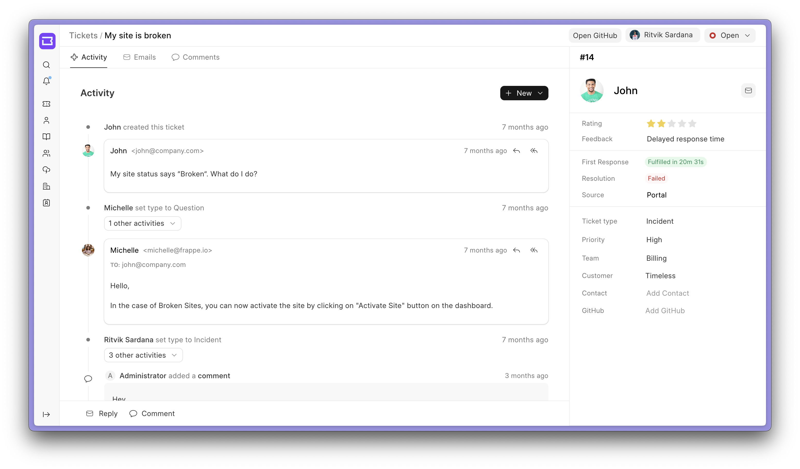
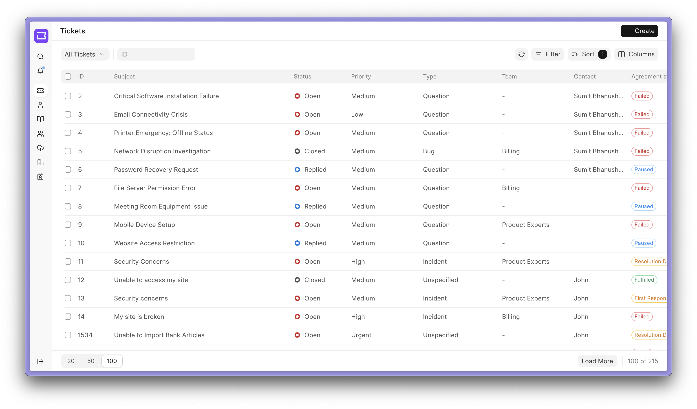
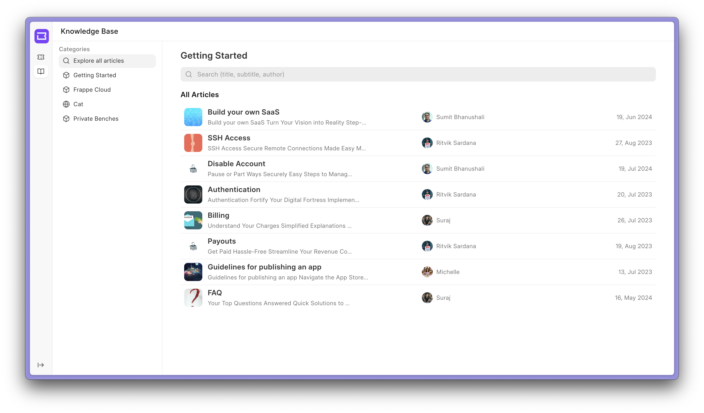
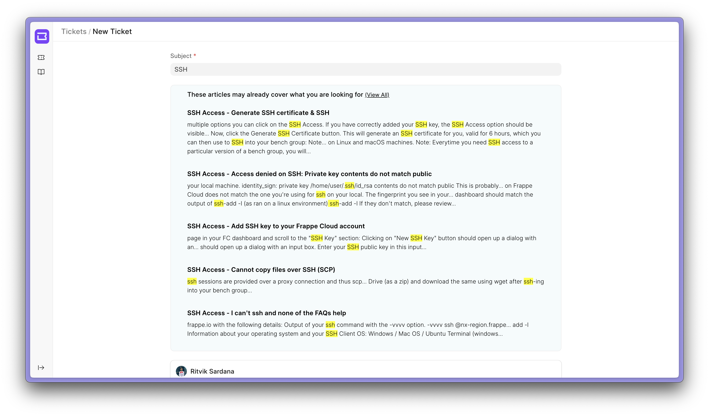

<div align="center" markdown="1">


<h1>DontManage Helpdesk</h1>

**Customer Service, Made Simple and Effective**


[](https://codecov.io/github/dontmanage/helpdesk)

<a href="https://trendshift.io/repositories/12764" target="_blank"></a>
</div>

</div>


<div align="center">
	
</div>
<br />
<div align="center">
	<a href="https://dontmanage.io/helpdesk">Website</a>
	-
	<a href="https://docs.dontmanage.io/helpdesk">Documentation</a>
</div>

## DontManage Helpdesk
DontManage Helpdesk is an 100% open-source Ticket Management tool which helps you  streamline your company's support, offers an easy setup, clean user interface, and automation tools to resolve customer queries efficiently.


### Motivation
Managing issues from our customers was a big challenge for us. We were using the DontManageErp support module which was not very good in UI and the UX was also not good. We wanted to have a tool that can be easily integrated with our existing system and can be customized as per our needs. So we decided to build DontManage Helpdesk.

### Key Features

- **Agent and Customer Portal Views**: Dual portals for agents and customers to simplify issue submission and management.

- **Customizable SLAs**: Discover how you can set and track SLAs for better response times.

- **Assignment Rules**: Custom auto-assignment of tickets based on priority, issue type, or workload.

- **Knowledge Base**: Learn how to create and manage help articles to empower users and reduce tickets.

- **Canned Responses**: Pre-written replies for common queries to ensure quick and consistent communication.

<details open>
<summary >View Screenshots</summary>
<h3></h3>

<div align="center">
	<sub>
		Agent List View
	</sub>
</div>




<div align="center">
	<sub>
		Upload articles and let your customer solve their queries through the Knowledge Base.
	</sub>
</div>



<div align="center">
	<sub>
		With advanced search, your customers will be recommended relevant articles regarding their issue.
	</sub>
</div>





</details>
<br>


### Under the Hood

- [**DontManage Framework**](https://github.com/dontmanage/dontmanage): A full-stack web application framework written in Python and Javascript.

- [**DontManage UI**](https://github.com/dontmanage/frappe-ui): A Vue-based UI library, to provide a modern user interface. 


## Production Setup

### Managed Hosting

You can try [DontManage Cloud](https://dontmanagecloud.com), a simple, user-friendly and sophisticated [open-source](https://github.com/dontmanage/press) platform to host DontManage applications with peace of mind.

It takes care of installation, setup, upgrades, monitoring, maintenance and support of your DontManage deployments. It is a fully featured developer platform with an ability to manage and control multiple DontManage deployments.

<div>
	<a href="https://dontmanagecloud.com/helpdesk/signup" target="_blank">
		<picture>
			<source media="(prefers-color-scheme: dark)" srcset="https://dontmanage.io/files/try-on-fc-white.png">
			
		</picture>
	</a>
</div>

### Self Hosting

Follow these steps to set up DontManage Helpdesk in production:

**Step 1**: Download the easy install script

```bash
wget https://dontmanage.io/easy-install.py
```

**Step 2**: Run the deployment command

```bash
python3 ./easy-install.py deploy \
    --project=helpdesk_prod_setup \
    --email=your_email.example.com \
    --image=ghcr.io/dontmanage/helpdesk \
    --version=stable \
    --app=helpdesk \
    --sitename subdomain.domain.tld
```

Replace the following parameters with your values:
- `your_email.example.com`: Your email address
- `subdomain.domain.tld`: Your domain name where Helpdesk will be hosted

The script will set up a production-ready instance of DontManage Helpdesk with all the necessary configurations in about 5 minutes.

## Development Setup

### Docker

You need Docker, docker-compose and git setup on your machine. Refer [Docker documentation](https://docs.docker.com/). After that, follow below steps:

**Step 1**: Setup folder and download the required files

    mkdir dontmanage-helpdesk
    cd dontmanage-helpdesk

    # Download the docker-compose file
    wget -O docker-compose.yml https://raw.githubusercontent.com/dontmanage/helpdesk/develop/docker/docker-compose.yml

    # Download the setup script
    wget -O init.sh https://raw.githubusercontent.com/dontmanage/helpdesk/develop/docker/init.sh

**Step 2**: Run the container and daemonize it

    docker compose up -d

**Step 3**: The site [http://helpdesk.localhost:8000/helpdesk](http://helpdesk.localhost:8000/helpdesk) should now be available. The default credentials are:
- Username: Administrator
- Password: admin

### Local

To setup the repository locally follow the steps mentioned below:

1. Install bench and setup a `dontmanage-bench` directory by following the [Installation Steps](https://dontmanageframework.com/docs/user/en/installation)
1. Start the server by running `bench start`
1. In a separate terminal window, create a new site by running `bench new-site helpdesk.test`
1. Map your site to localhost with the command `bench --site helpdesk.test add-to-hosts`
1. Get the Helpdesk app. Run `bench get-app https://github.com/dontmanage/helpdesk`
1. Run `bench --site helpdesk.test install-app helpdesk`.
1. Now open the URL `http://helpdesk.test:8000/helpdesk` in your browser, you should see the app running


**For Frontend Development**
1. Open a new terminal session and cd into `dontmanage-bench/apps/helpdesk/desk`, and run the following commands:
    ```
    yarn install
    yarn dev or yarn dev --host helpdesk.test
    ```
1. Now, you can access the site on vite dev server at `http://helpdesk.test:8080`

**Note:** You'll find all the code related to Helpdesk's frontend inside `dontmanage-bench/apps/helpdesk/desk`

## Learn and connect

- [Telegram Public Group](https://t.me/dontmanagedesk)
- [Discuss Forum](https://discuss.dontmanage.io/c/dontmanagehelpdesk/69)
- [Documentation](https://docs.dontmanage.io/helpdesk)

<br>
<br>
<div align="center">
	<a href="https://dontmanage.io" target="_blank">
		<picture>
			<source media="(prefers-color-scheme: dark)" srcset="https://dontmanage.io/files/DontManage-white.png">
			
		</picture>
	</a>
</div>
